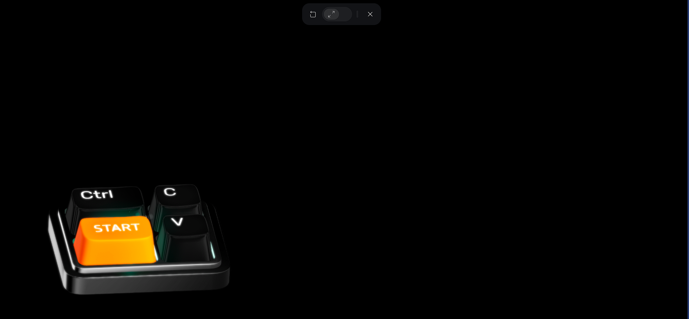

In the demo section, we will have a small ctrl+c & ctrl+v keyboard spline model from src\design\desktop-web\components\keyboard (USE THIS!), a video frame next to it, and a live chat box to its right. This outlines the components we will need for this section.
# 1. Transition

Use the Aceternity `ContainerScroll` component for the transition to the testimonial section:

https://21st.dev/community/components/aceternity/container-scroll-animation/default

Integrate it into the codebase as a React component.

## Project requirements

The codebase should support:

- shadcn project structure
- Tailwind CSS
- TypeScript

If any of these are missing, include setup instructions for:

- shadcn CLI
- Tailwind CSS
- TypeScript

## Default paths

Determine the default locations for:

- components
- styles

If the default components path is not `/components/ui`, explain why creating that folder is important.

## Add this component to `/components/ui`

```tsx
container-scroll-animation.tsx
"use client";
import React, { useRef } from "react";
import { useScroll, useTransform, motion, MotionValue } from "framer-motion";

export const ContainerScroll = ({
    titleComponent,
    children,
}: {
    titleComponent: string | React.ReactNode;
    children: React.ReactNode;
}) => {
    const containerRef = useRef<HTMLDivElement>(null);
    const { scrollYProgress } = useScroll({
        target: containerRef,
    });
    const [isMobile, setIsMobile] = React.useState(false);

    React.useEffect(() => {
        const checkMobile = () => {
            setIsMobile(window.innerWidth <= 768);
        };
        checkMobile();
        window.addEventListener("resize", checkMobile);
        return () => {
            window.removeEventListener("resize", checkMobile);
        };
    }, []);

    const scaleDimensions = () => {
        return isMobile ? [0.7, 0.9] : [1.05, 1];
    };

    const rotate = useTransform(scrollYProgress, [0, 1], [20, 0]);
    const scale = useTransform(scrollYProgress, [0, 1], scaleDimensions());
    const translate = useTransform(scrollYProgress, [0, 1], [0, -100]);

    return (
        <div
            className="h-[60rem] md:h-[80rem] flex items-center justify-center relative p-2 md:p-20"
            ref={containerRef}
        >
            <div
                className="py-10 md:py-40 w-full relative"
                style={{ perspective: "1000px" }}
            >
                <Header translate={translate} titleComponent={titleComponent} />
                <Card rotate={rotate} translate={translate} scale={scale}>
                    {children}
                </Card>
            </div>
        </div>
    );
};

export const Header = ({ translate, titleComponent }: any) => {
    return (
        <motion.div
            style={{ translateY: translate }}
            className="div max-w-5xl mx-auto text-center"
        >
            {titleComponent}
        </motion.div>
    );
};

export const Card = ({
    rotate,
    scale,
    children,
}: {
    rotate: MotionValue<number>;
    scale: MotionValue<number>;
    translate: MotionValue<number>;
    children: React.ReactNode;
}) => {
    return (
        <motion.div
            style={{
                rotateX: rotate,
                scale,
                boxShadow:
                    "0 0 #0000004d, 0 9px 20px #0000004a, 0 37px 37px #00000042, 0 84px 50px #00000026, 0 149px 60px #0000000a, 0 233px 65px #00000003",
            }}
            className="max-w-5xl -mt-12 mx-auto h-[30rem] md:h-[40rem] w-full border-4 border-[#6C6C6C] p-2 md:p-6 bg-[#222222] rounded-[30px] shadow-2xl"
        >
            <div className="h-full w-full overflow-hidden rounded-2xl bg-gray-100 dark:bg-zinc-900 md:rounded-2xl md:p-4">
                {children}
            </div>
        </motion.div>
    );
};
```

## Add this demo component

```tsx
demo.tsx
"use client";
import React from "react";
import { ContainerScroll } from "@/components/ui/container-scroll-animation";
import Image from "next/image";

export function HeroScrollDemo() {
    return (
        <div className="flex flex-col overflow-hidden pb-[500px] pt-[1000px]">
            <ContainerScroll
                titleComponent={
                    <>
                        <h1 className="text-4xl font-semibold text-black dark:text-white">
                            Unleash the power of <br />
                            <span className="text-4xl md:text-[6rem] font-bold mt-1 leading-none">
                                Scroll Animations
                            </span>
                        </h1>
                    </>
                }
            >
                <Image
                    src={`https://ui.aceternity.com/_next/image?url=%2Flinear.webp&w=3840&q=75`}
                    alt="hero"
                    height={720}
                    width={1400}
                    className="mx-auto rounded-2xl object-cover h-full object-left-top"
                    draggable={false}
                />
            </ContainerScroll>
        </div>
    );
}
```

## Install dependencies

```bash
framer-motion
```

## Integration checklist

1. Copy the code into the correct directories
2. Install external dependencies
3. Use known-valid Unsplash stock images
4. Use `lucide-react` icons if SVGs or logos are needed

## Component analysis

Review:

- required dependencies
- props and state
- required context providers or hooks

## Questions to confirm

- What data or props will be passed in?
- Is any state management required?
- Are any assets needed?
- What should the responsive behavior be?
- Where should this component live in the app?

## Layout

Layout

Place a 16:9 video player inside the scrollable card above, filling the card.

Add a small live chat pop-up attached to the bottom-right of the video, overlapping it slightly and with visual depth. The chat should accept typed messages and display reactions.

The keyboard component (src\design\desktop-web\components\keyboard) should sit directly below the card (not inside the scrollable container), offset slightly to the left and visually connected to the video by a wire.

The keyboard appears only when the container flattens and the video is fully visible. The chat remains visible at all times and should clearly respond to keyboard interactions.

Use a transparent spline canvas so the keyboard and wire are visible. The wire should resemble a power cable and clearly connect the keyboard to the video frame. Pan the canvas so the wire fills the space between the video and the keyboard. (Keyboard reference: )

Pressing the keyboard's "Start" button or the "Control" button should toggle mute/unmute for the commentator AI and affect chat activity as described below.

The chat must allow typing and show simulated reactions from others: lively emoji/text reactions when AI is unmuted and minimal/boring reactions when muted.


## Functionality (Read-to-know only for now)

- The video should loop.
- It should start with only the video sound enabled.
- The commentator AI should start muted.
- The live chat should be active, but minimal and boring by default.

### Keyboard interaction

When the keyboard button is clicked:

- Unmute the commentator AI and increase chat activity/reactions.
- Click again to mute the commentator AI and reduce chat activity.

## Comparison slider

Add the comparison slider from:

`src\design\desktop-web\components\comparison-slider`

Place it inside the video frame to show the difference between the muted and unmuted states.

Requirements:
- the slider appears only when the user clicks the keyboard button to unmute or mute the commentator AI then disappear when the animation is done.
- it should visually compare both states side by side
- the effect should be clear
- it should not be clickable
- it should act as a visual layer only
- it should snap left and right in sync with the keyboard interaction
- it should highlight the impact of the keyboard on the video and live chat

Requirements:
- The slider appears only during the mute/unmute animation triggered by the keyboard and hides when the animation finishes.
- It visually compares muted vs. unmuted states side-by-side as a non-interactive overlay.
- It should snap left/right in sync with the keyboard interaction and clearly highlight the keyboard's effect on the video and chat.