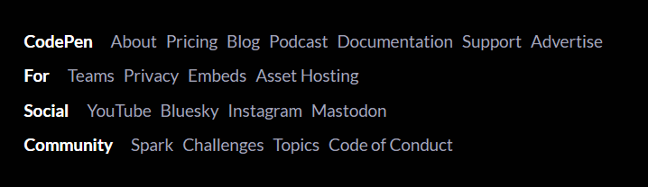

For the footer, I need you to take the best of both footer.md and footer2.md

Look into (image.png) and (image-1.png).

I want you to take the "Streamline Your workflow" Section(the pixelated flowing part only) from the component1.md, ignore the upper footer part section it has. Take the component2.md footer section and put it into that section

Change the "Streamline Your Workflow" to "Elevate YOUR Experience"

take inspiration from image-2.png which is from CodePen's footer. The main show here is that hook: "CodePen For Social Community" (The first words on each row). I want you to position so as to follow this creative design. But put it horizontal. 

Audit: 
The typography is still not like the original. The original is like a matrix+pixel inspired kind of typography. Adjust so the typography is exactly like so. The current typography is just the text being transparent and rely on the matrice movement in the background for the pixel feel. 